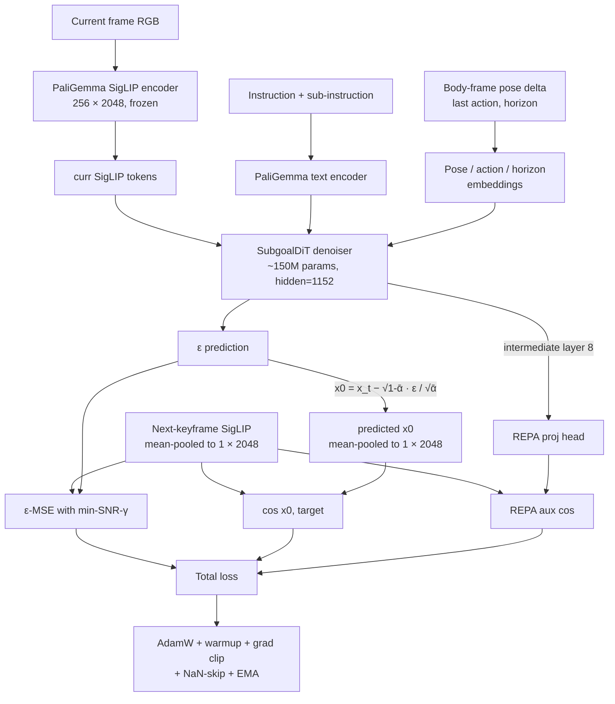

# SkyVLA

[](https://codcodingcode.github.io/SkyVLA/)
[](https://wandb.ai/nathanyan2008p-personal/skyvla-subgoal-dit)
[](LICENSE)

Aerial vision-language navigation for the [OpenFly](https://github.com/SHAILAB-IPEC/OpenFly-Platform) benchmark.

```
RGB ─► PaliGemma 3B (frozen + LoRA) ─► curr SigLIP ──┬──► SubgoalDiT (~150M) ─► predicted subgoal
                                                     │                                  │
                                                     └────► cross-attn + action head ◄──┘
                                                                       │
                                                                       ▼
                                                              discrete action (0..7)
```

## Demo

P3 policy (PaliGemma BC + SubgoalDiT) navigating the unseen `env_ue_smallcity` Unreal scene. 1920×1080 FPV with HUD; companion top-down view tracks position vs goal.

https://github.com/CodCodingCode/SkyVLA/raw/main/videos/p3_realsim.mp4

> Files: [`videos/p3_realsim.mp4`](videos/p3_realsim.mp4) (FPV) · [`videos/p3_realsim_topdown.mp4`](videos/p3_realsim_topdown.mp4) (map). Reproducer in [`docs/RECORDING_DEMOS.md`](docs/RECORDING_DEMOS.md).

## What's new — May 2026 world-model breakthrough

For two weeks the `SubgoalDiT` validation cosine similarity sat at the noise floor (`val_cos ≈ 0`) despite training loss dropping cleanly. We tracked it to a degenerate ε-MSE minimum: the model was learning to predict near-mean noise, which minimises MSE while contributing nothing to direction. Three changes broke the collapse.

1. **Mean-pool the subgoal target to 1 × 2048.** Predicting all 256 SigLIP tokens dilutes the directional signal. The PaliGemma policy's cross-attention already pools tokens to a single scene summary — so pooling at the WM target costs nothing downstream and concentrates supervision on the direction the policy actually uses. `--subgoal_pool mean` in [`openfly/train_subgoal_dit.py`](openfly/train_subgoal_dit.py).
2. **Add a direct cos-loss term on `x0`.** Reconstruct the model's predicted `x0` from the ε prediction every step, take cosine similarity with the target, add `(1 − cos)` to the loss with weight 0.3. ε-MSE has the degenerate minimum; cos-on-`x0` does not. `--cos_loss_weight 0.3`.
3. **Keep [REPA](https://arxiv.org/abs/2410.06940) on as a representation regulariser.** Auxiliary alignment between an intermediate DiT layer and the target stayed near +0.99 throughout — useful as a prior even when its own gradient is small. `--repa_layer_idx 8 --repa_weight 0.1`.

Results across two epochs of the balanced 50 k step-pair set (10 k cap per env after the image-existence filter — see CLAUDE.md for why per-env episode caps don't actually balance):

| Epoch | train_loss | val_loss | **val_cos (seen)** | **val_cos (unseen)** |
|------:|-----------:|---------:|-------------------:|---------------------:|
| 0 | 0.838 | 1.007 | **+0.086** | **+0.085** |
| 1 | 0.811 | 1.019 | **+0.107** | **+0.108** |

First time clearing the noise floor in the whole investigation, with the unseen split tracking — and at epoch 1 *beating* — the seen split. An 8-epoch resume run is in flight; live curves on [W&B](https://wandb.ai/nathanyan2008p-personal/skyvla-subgoal-dit/runs/balanced_50k_pooled_cosloss_clean).

### How the WM loss is wired



### Training-quality dashboard

W&B logs only progress signals — no per-step jitter, no constants, no operational counters. Per-epoch: `val/cos_seen`, `val/cos_ood`, `val/cos_gap_seen_ood`, `val/best_cos`. Per-step (EMA-smoothed, ~50-step half-life): `train/loss_ema`, `train/train_cos_ema`, `train/cos_loss_ema`, `train/repa_loss_ema`. Health: `epoch/nan_skip_ratio`. The logging policy is enforced in [`CLAUDE.md`](CLAUDE.md) under "W&B is on by default" and implemented in [`openfly/train_subgoal_dit.py`](openfly/train_subgoal_dit.py).

### Crash-resilient training

The A100 on this host throws periodic NVIDIA Xid 43 ("GPU stopped processing") errors. The DiT trainer ships with `--auto_resume --ckpt_every_steps 500` and a tmux crash-loop wrapper so a mid-run segfault drops at most ~3 min of training and resumes from `last.pt` with optimizer / EMA / history intact. See [`CLAUDE.md`](CLAUDE.md) for the full pattern.

1. **P1 — behaviour cloning.** PaliGemma + LoRA + action head, offline on OpenFly's `train.json`.
2. **P2 — world model.** `SubgoalDiT` is a feature-space DDPM (~150M, PixArt-Σ-init DiT) that predicts the next-keyframe SigLIP tokens from the current frame, instruction, and pose delta. PaliGemma is frozen for this stage so the diffusion loss is the only signal. The original from-scratch DiT and a thin-adapter PixArt variant both plateaued at the noise floor — see "What's new" above for the fix.
3. **P3 — subgoal-conditioned policy.** The frozen world model feeds the policy via cross-attention. Online RL — GRPO on PaliGemma, PPO on the OpenFly-Agent 7B baseline — updates only the action head, with an easy → medium → hard reward curriculum on the GRPO run.

Eval uses OpenFly's seen / unseen splits, with a per-env breakdown for the three unseen scenes (`env_game_gtav`, `env_ue_smallcity`, `env_gs_sjtu02`).

## Quick start

```bash
git clone https://github.com/CodCodingCode/SkyVLA.git ~/SkyVLA
cd ~/SkyVLA

bash openfly/setup.sh                              # conda env, OpenFly-Platform clone, annotations
bash openfly/download_scene.sh env_airsim_16       # ~2 GB
source openfly/activate.sh
bash openfly/run_eval.sh --split unseen --policy heuristic \
  --env_filter env_airsim_16 --max_episodes 5
```

Eval JSON lands in `logs/benchmarks/`.

## Train

```bash
export OPENFLY_IMAGE_ROOT=~/assets/OpenFly/images/Image

# P1 — BC
bash openfly/run_train_paligemma.sh --epochs 10 --batch_size 8

# P2 — world model (PaliGemma frozen, SigLIP-token diffusion)
bash openfly/run_train_subgoal_dit.sh

# P3 — RL on the subgoal-conditioned policy
bash openfly/run_train_curriculum.sh \
  --init_ckpt logs/openfly/paligemma/<run>/last.pt \
  --steps_easy 80 --steps_medium 60 --steps_hard 60

# Eval any checkpoint
bash openfly/run_eval.sh --split unseen --policy paligemma \
  --paligemma_ckpt logs/openfly/<run>/last.pt
```

A second training track ships for the upstream OpenFly-Agent (OpenVLA 7B) via FSDP — see [`openfly/README.md`](openfly/README.md).

## Layout

```
openfly/
  eval_benchmark.py              eval harness
  train_paligemma.py             P1 — BC
  train_subgoal_dit.py           P2 — SigLIP-token diffusion world model
  train_grpo_paligemma.py        P3 — GRPO on PaliGemma
  train_curriculum_grpo.py       P3 — easy → medium → hard reward curriculum
  train_ppo_openfly_agent.py     P3 — PPO + LoRA + value head on OpenFly-Agent 7B
  models/
    paligemma_vln.py             BC backbone
    subgoal_dit.py               world model (vanilla DiT)
    subgoal_dit_pixart.py        failed ablation — PixArt-Σ frozen backbone + thin adapter
    openfly_agent_rl.py          7B + value head
  envs/airsim_vln_env.py         gymnasium wrapper around the AirSim / UE bridge
  rewards.py, rollout.py         episode rewards + trajectory collection
vla/                             portable PaliGemma feature extractor + design notes
docs/                            research plan, setup, fairness, Jekyll site
logs/                            training and benchmark outputs (gitignored)
```

## Docs

| File | What's in it |
|---|---|
| [`docs/RESEARCH.md`](docs/RESEARCH.md) | research question, splits, reward curriculum, experiment matrix |
| [`docs/WHITEPAPER.md`](docs/WHITEPAPER.md) | motivation, architecture, expected contribution |
| [`docs/implementation.md`](docs/implementation.md) | one-page tour: env, data, policy, world model, training, eval |
| [`docs/A100_SETUP.md`](docs/A100_SETUP.md) | end-to-end host bring-up on an x86_64 A100 |
| [`docs/BENCHMARK_FAIRNESS.md`](docs/BENCHMARK_FAIRNESS.md) | what each leaderboard number can and can't claim |
| [`vla/VLA_SYSTEM.md`](vla/VLA_SYSTEM.md) | PaliGemma + LoRA backbone notes |
| [Project site](https://codcodingcode.github.io/SkyVLA/) | the same content, browsable |

## Requirements

- x86_64 Linux with an NVIDIA GPU. The upstream UE scene binaries are x86 only — no GH200 / aarch64.
- 24 GB VRAM covers P1–P3 except the OpenFly-Agent 7B FSDP track, which needs more.
- Python 3.10 inside a conda env named `openfly` (created by `openfly/setup.sh`).

## License

MIT.
