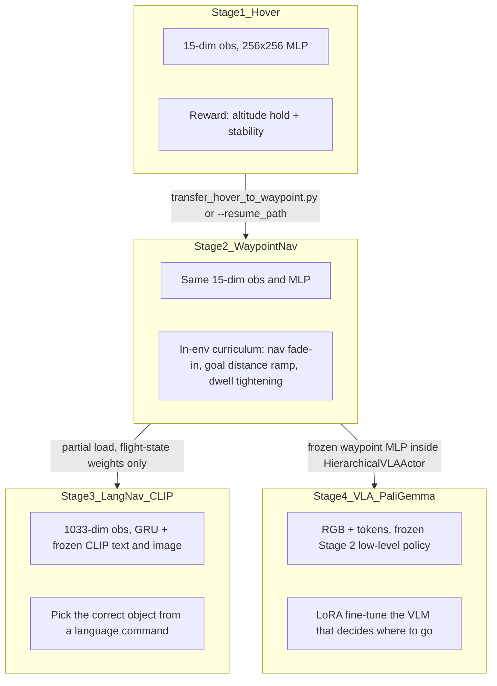

# Curriculum Learning

This project trains a Crazyflie quadcopter to follow natural-language commands inside Isaac Sim. We do not learn the full task end-to-end. Instead, we walk the policy up a four-stage curriculum, where each stage extends the previous one with strictly more task structure while preserving the low-level flight skills that have already been learned.

The same `256 x 256` MLP geometry is reused across every stage. Whenever the observation space grows, the input layer is expanded in place and only the columns that correspond to flight state are copied over from the prior checkpoint; new vision and language columns start out zero-initialized so the policy keeps flying competently from step 0.

## Pipeline at a glance



## Stage-by-stage breakdown

| Stage | Module | What the drone learns | Key files |
|-------|--------|-----------------------|-----------|
| 1 | [hover/](../hover) | Basic flight: altitude hold, stability, thrust control | [hover_env.py](../hover/hover_env.py), [train.py](../hover/train.py) |
| 2 | [waypoint_nav/](../waypoint_nav) | Point-to-point navigation with a reward curriculum (survival warmup, nav fade-in, goal-distance ramp, dwell tightening) | [waypoint_nav_env.py](../waypoint_nav/waypoint_nav_env.py), [train.py](../waypoint_nav/train.py) |
| 3 | [lang_nav/](../lang_nav) | Language-grounded object selection via frozen CLIP text and image embeddings | [lang_drone_env.py](../lang_nav/lang_drone_env.py), [clip_grounder.py](../lang_nav/clip_grounder.py) |
| 4 | [vla/](../vla) | Full VLA: PaliGemma predicts the target, the frozen Stage 2 policy executes flight, with a precision curriculum after roughly 200 iterations | [vla_drone_env.py](../vla/vla_drone_env.py), [vla_policy.py](../vla/vla_policy.py), [VLA_SYSTEM.md](../vla/VLA_SYSTEM.md) |

### Stage 1 — Hover

The drone sits in an empty arena and learns to hold altitude at a randomly sampled target while staying upright. The observation is a 15-dim vector of linear velocity, angular velocity, projected gravity, body-frame target position, and world-frame position error. The reward combines XY and Z distance shaping, an uprightness term, velocity penalties, an alive bonus, and a `+5` success bonus when the drone is within `0.8 m` of the target. Training runs across 1024 parallel environments for 1500 PPO iterations.

### Stage 2 — Waypoint navigation

The observation space is identical to Stage 1, which is what makes weight transfer trivial. What changes is the task: the drone now flies to a distant goal, dwells there, and then a fresh waypoint respawns mid-episode. The policy is initialized from the hover checkpoint either with [transfer_hover_to_waypoint.py](../scripts/transfer_hover_to_waypoint.py) (a direct copy that resets the optimizer) or by passing the hover `.pt` straight to `--resume_path`.

Most of the curriculum work happens inside the environment itself:

- **Survival warmup.** For the first 5,000 steps only the alive and uprightness terms are active.
- **Navigation fade-in.** Over the next 10,000 steps a `nav_multiplier` ramps from 0 to 1, gradually mixing in the navigation reward terms.
- **Goal distance ramp.** Goals start out 0.5 to 1.5 m away and grow to 1.0 to 3.0 m over 60,000 steps.
- **Dwell zone curriculum.** The acceptance radius tightens from 1.0 m down to 0.15 m over 40,000 steps so the drone is forced to stop precisely.

### Stage 3 — Language navigation

The policy now receives a 1033-dim observation: a 9-dim flight-state slice plus a 512-dim CLIP text embedding for the command and a 512-dim CLIP image embedding from the onboard camera. The architecture switches from a pure MLP to a GRU recurrent policy with `256` hidden units. Training runs at 1024 envs for 3000 iterations with `--enable_cameras`.

Stage 3 reuses the same survival-warmup and nav-fade-in pattern from Stage 2. Reaching the correct object within `0.35 m` yields `+10`, reaching the wrong object yields `-5`, plus dwell, proximity, and pinpoint bonuses. Loading is shape-tolerant: keys whose shapes do not match (for example because the GRU block didn't exist in the Stage 2 MLP) are skipped instead of erroring.

### Stage 4 — Full VLA

The VLA stage replaces frozen CLIP with PaliGemma 3B (LoRA-fine-tuned) and switches to a hierarchical actor. PaliGemma plus a cross-attention head plus an LSTM produce a target position, which is fed into the **frozen Stage 2 waypoint MLP** to compute the actual thrust-and-moment action. This way the high-level policy only has to learn "where to go" while the low-level controller is taken as solved. A short precision curriculum kicks in after about 200 iterations: loose distance and proximity rewards fade out while hover and success rewards amplify, teaching the drone to stop at the target rather than fly through it. Training runs at 256 envs for 5000 iterations with separate optimizers for PPO, the auxiliary cross-attention head (`3e-4`), and LoRA (`1e-6`, enabled after iteration 50).

For the full VLA architecture spec (token layout, auxiliary losses, LoRA targets) see [VLA_SYSTEM.md](../vla/VLA_SYSTEM.md).

## Weight transfer mechanics

All [transfer scripts](../scripts) follow the same recipe:

1. Load the prior-stage checkpoint.
2. Copy the **flight-state columns** (the first 9 obs dims: linear velocity, angular velocity, projected gravity) into the expanded input layer.
3. **Zero-init** every new vision or language input column so the first hidden layer initially ignores them and the policy keeps the flight skills it just learned.
4. Copy the hidden and output MLP weights directly. The `256 x 256` geometry is preserved across stages by design.
5. Reset the optimizer state and iteration counter, and reset the observation normalizer's count to a small value (around 100) so it re-converges quickly on the new input statistics.

The exact dimension expansion per script:

| Script | Stages | Input dim |
|--------|--------|-----------|
| [transfer_hover_to_waypoint.py](../scripts/transfer_hover_to_waypoint.py) | hover -> waypoint | 15 -> 15 (direct copy) |
| [transfer_waypoint_to_vla_siglip.py](../scripts/transfer_waypoint_to_vla_siglip.py) | waypoint -> lang_nav (SigLIP) | 15 -> 1546 |
| [transfer_waypoint_to_vla.py](../scripts/transfer_waypoint_to_vla.py) | waypoint -> VLA action head | 15 -> 2057 |
| [transfer_waypoint_to_pi0.py](../scripts/transfer_waypoint_to_pi0.py) | waypoint -> Pi0 action head | 15 -> 2057 |

The `2057`-dim layout is `[PaliGemma features (2048) | flight state (9)]`; the flight columns sit at the end, which is why the transfer code copies them into `cols[2048:2057]` rather than `cols[0:9]`.

The resume behaviour also differs by stage:

- **Stage 2** uses RSL-RL's `runner.load(...)` for a full state-dict load.
- **Stage 3** does a partial load that skips shape mismatches, so the same checkpoint can migrate from a Stage 2 MLP into the Stage 3 GRU.
- **Stage 4** runs a custom PPO loop and applies the same shape-tolerant filter on `model_state_dict`.

## End-to-end command sequence

```bash
source ~/drone_project/activate_env.sh
cd ~/IsaacLab

# Stage 1: hover
./isaaclab.sh -p ~/drone_project/hover/train.py \
    --num_envs 1024 --max_iterations 1500 --headless

# Stage 2: waypoint navigation, resumed from hover
python ~/drone_project/scripts/transfer_hover_to_waypoint.py \
    --hover_checkpoint ~/drone_project/checkpoints/stage1_hover.pt \
    --output_path logs/rsl_rl/waypoint_nav/pretrained_init.pt
./isaaclab.sh -p ~/drone_project/waypoint_nav/train.py \
    --num_envs 1024 --max_iterations 2000 --headless \
    --resume_path logs/rsl_rl/waypoint_nav/pretrained_init.pt

# Stage 3: language navigation (CLIP)
bash ~/drone_project/scripts/train_lang_nav.sh

# Stage 4: full VLA (PaliGemma)
./isaaclab.sh -p ~/drone_project/vla/train.py \
    --num_envs 256 --max_iterations 5000 --headless --enable_cameras
```

For domain fine-tunes (warehouse scenes, Cesium tiles), behaviour-cloning baselines, and the Pi0 alternative, see [ADVANCED.md](ADVANCED.md).
