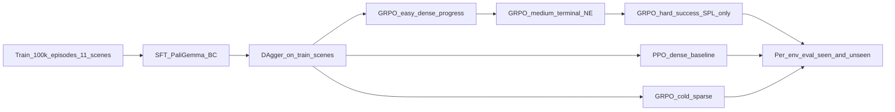

# Curriculum Sparse RL for OpenFly Unseen Generalization

This document is the canonical research narrative for the SkyVLA codebase.
It explains the question we are trying to answer, the experimental
protocol, the reward curriculum, and how to read the results. It is
deliberately scoped so that an honest paragraph-long contribution
statement could be written from it without overclaiming.

> Companion docs:
> [`BENCHMARK_FAIRNESS.md`](BENCHMARK_FAIRNESS.md) (what is claimable),
> [`A100_SETUP.md`](A100_SETUP.md) (host bring-up),
> [`NEXT_STEPS.md`](NEXT_STEPS.md) (engineering checklist).

## 1. Research question

> After imitation on OpenFly `train`, does a reward-sparsity curriculum
> during online RL improve navigation on **genuinely new scenes**
> (`env_game_gtav`, `env_ue_smallcity`, `env_gs_sjtu02`) beyond BC and
> DAgger alone — and **which type of domain shift does RL actually
> fix**?

The contribution we are aiming for is not a new VLN architecture or a
new benchmark. It is a careful study of when online RL with
benchmark-aligned sparse reward helps imitation-trained aerial VLN
policies, broken out by the type of unseen shift (renderer / layout /
recon style).

## 2. What is "unseen" in OpenFly?

OpenFly's splits are not random train/val/test slices; they are
cross-scene splits, and that is what makes them informative.

| Split | File | Episodes | Role in this project |
|-------|------|----------|----------------------|
| `train` | [`assets/OpenFly/Annotation/train.json`](https://huggingface.co/datasets/IPEC-COMMUNITY/OpenFly/tree/main/Annotation) | 100,226 | SFT, DAgger, RL rollouts |
| `seen` | `seen.json` | 1,800 | Dev / monitoring (same 11 scenes as train) |
| `unseen` | `unseen.json` | 1,200 | **Primary claim**: 3 never-trained scenes |

The three unseen environments are deliberately heterogeneous. Reporting a
single averaged `unseen` SR hides the most interesting signal:

| Unseen env | Shift type | Why it matters |
|------------|------------|----------------|
| `env_game_gtav` | New renderer + game world (no GTA in train) | Hardest visual OOD |
| `env_ue_smallcity` | New UE layout (train has `ue_bigcity` only) | Layout / semantics OOD with same engine |
| `env_gs_sjtu02` | New 3DGS campus (train has `gs_sjtu01`) | Real-to-sim recon-style OOD |

There is also a secondary altitude shift: unseen episodes have median
mid-trajectory altitude ~**73 m** versus ~**23 m** for train. We track
altitude as a covariate in the failure analysis.

## 3. Method overview



We use [`PaliGemmaVLNPolicy`](../openfly/models/paligemma_vln.py)
(PaliGemma 3B with LoRA, plus a small cross-attention pool, LSTM, and
10-class action head) as the policy backbone, and the kinematic AirSim
gymnasium env [`AirSimVLNEnv`](../openfly/envs/airsim_vln_env.py) for
rollouts.

### 3.1 Reward presets

Implemented in [`openfly/rewards.py`](../openfly/rewards.py). Each preset
is a `RewardConfig` selected via the `--reward_preset` flag on the GRPO
and PPO trainers, plumbed through `AirSimVLNEnvConfig.reward_preset`.

| Preset | `progress_scale` | `ne_scale` | `success_scale` | `dense_progress` | Interpretation |
|--------|------------------|-----------|------------------|------------------|----------------|
| `easy`   | 0.1   | 1/40 | 15.0 | True  | Thick step shaping + soft terminal terms |
| `medium` | 0.0   | 1/40 | 15.0 | False | Terminal NE penalty + soft success |
| `hard`   | 0.0   | 0.0  | 20.0 | False | Almost-binary success + SPL only |

The success radius (20 m) and SPL weight are constant across stages so
the reward stays comparable to OpenFly's eval metrics
([`BENCHMARK_FAIRNESS.md`](BENCHMARK_FAIRNESS.md)).

### 3.2 Curriculum driver

[`openfly/train_curriculum_grpo.py`](../openfly/train_curriculum_grpo.py)
orchestrates the three stages as subprocesses of
[`train_grpo_paligemma.py`](../openfly/train_grpo_paligemma.py). Each
stage:

1. Loads the previous stage's `last.pt` as `--init_ckpt`.
2. Sets `--reward_preset` to its preset name.
3. Optionally filters rollouts by `--traj_category` (substring on
   `image_path`, e.g. `short` -> `medium_average` -> `long`).
4. Writes its own `last.pt`, `history.json`, `rollouts.jsonl`,
   `manifest.json` under `logs/openfly/curriculum/<run>/stage_<name>/`.

A `curriculum_manifest.json` is written at the run root so each
experiment is self-describing.

## 4. Experimental matrix

All training checkpoints are evaluated identically: same harness, same
`--max_steps`, per-env unseen breakdown.

| Stage | Source | Reward | Init | Notes |
|-------|--------|--------|------|-------|
| **B0** Heuristic | [`run_eval.sh --policy heuristic`](../openfly/run_eval.sh) | n/a | n/a | Oracle (gets goal). Sanity check, not a VLM result. |
| **B1** SFT | [`run_train_paligemma.sh`](../openfly/run_train_paligemma.sh) | n/a | random head | CE on expert actions, full `train`. |
| **B2** DAgger | [`run_train_dagger.sh`](../openfly/run_train_dagger.sh) | n/a | B1 | On-policy correction in train AirSim scenes. |
| **B3** RL dense | [`run_train_ppo_agent.sh --dense_progress`](../openfly/run_train_ppo_agent.sh) or `--reward_preset easy` | easy | B2 | Strong baseline; dense shaping. |
| **B4** RL cold sparse | [`run_train_grpo.sh --reward_preset hard`](../openfly/run_train_grpo.sh) | hard | B2 | Goes straight to sparse; tests whether curriculum is needed. |
| **B5** RL curriculum | [`run_train_curriculum.sh`](../openfly/run_train_curriculum.sh) | easy -> medium -> hard | B2 | The method we are studying. |

### 4.1 Reproducible commands

```bash
# Phase 0 — automated gates (driver, annotations, image root, SFT
# dataset, reward presets, heuristic policy). Each gate prints
# PASS/FAIL and the script exits non-zero on the first failure.
bash openfly/scripts/verify_phase0.sh

# Phase 0 — scene binaries (each is multi-GB; only env_airsim_16 is
# needed for SFT/DAgger/RL training; the three unseen binaries are
# only needed for the per-env unseen eval).
bash openfly/download_scene.sh env_airsim_16
bash openfly/download_scene.sh env_game_gtav
bash openfly/download_scene.sh env_ue_smallcity
bash openfly/download_scene.sh env_gs_sjtu02

# Full B0 -> B5 matrix in one go (run under tmux/nohup; ~hours):
bash openfly/run_experiments.sh

# Or stage-by-stage:

# B1: SFT (~10 epochs)
bash openfly/run_train_paligemma.sh --epochs 10 --batch_size 8

# B2: DAgger from B1
bash openfly/run_train_dagger.sh \
  --sft_ckpt logs/openfly/paligemma/<run>/last.pt \
  --iterations 3 --episodes_per_iter 200

# B3: PPO dense baseline from B2 (using easy preset)
bash openfly/run_train_ppo_agent.sh \
  --reward_preset easy \
  --iterations 20 --episodes_per_iter 4

# B4: GRPO cold sparse from B2
bash openfly/run_train_grpo.sh \
  --init_ckpt logs/openfly/dagger/<run>/last.pt \
  --steps 200 --reward_preset hard

# B5: curriculum GRPO from B2
bash openfly/run_train_curriculum.sh \
  --init_ckpt logs/openfly/dagger/<run>/last.pt \
  --env_filter env_airsim_16 \
  --steps_easy 80 --steps_medium 60 --steps_hard 60
```

### 4.2 Per-env unseen eval (run for every checkpoint)

```bash
for ENV in env_game_gtav env_ue_smallcity env_gs_sjtu02; do
  bash openfly/run_eval.sh --split unseen --policy paligemma \
    --paligemma_ckpt <ckpt> --env_filter "$ENV" --max_episodes 50
done
# Always also run --split seen as a dev signal:
bash openfly/run_eval.sh --split seen --policy paligemma \
  --paligemma_ckpt <ckpt> --max_episodes 200
```

Each eval writes `logs/benchmarks/openfly_*.json`, which now includes
a `per_env` breakdown and `checkpoint` / `max_steps` / `env_filter`
metadata.

### 4.3 Aggregating results

```bash
python -m openfly.scripts.aggregate_results \
  --logs_dir logs/benchmarks --per-env \
  --output docs/results_table.md
```

Drop the resulting Markdown table into the
[`results.md`](results.md) Jekyll page (or [section 6](#6-results) of
this doc) when populated.

## 5. What to measure and how to read it

For each checkpoint we report:

* **SR** (success rate within 20 m, with stop action)
* **OSR** (oracle success — any point within 20 m, ignores stop)
* **NE** (mean navigation error in metres)
* **SPL** (success weighted by path length)

Per **(policy, split, env_filter)** triple. For the unseen breakdown we
keep GTA, UE smallcity, and GS sjtu02 separate.

Auxiliary diagnostics (collected from `episodes[]` entries in the
benchmark JSON, plus from the GRPO `rollouts.jsonl`):

* Sample budget (rollout episodes, wall time) per stage.
* Failure-mode tags via
  [`openfly.scripts.analyse_failures`](../openfly/scripts/analyse_failures.py):
  `wandered`, `stalled`, `oracle_only`, `near_miss`, `image_error`.
  Run with `--inputs 'logs/benchmarks/openfly_unseen_*.json' --output
  docs/failure_modes.md` and copy the resulting tables into
  [`results.md`](results.md).
* Reward curve per stage of B5 (does the policy keep improving when the
  shaping drops?).

### Success criterion for "research worked"

The study is informative if **either** of the following holds:

1. **B5 beats B2 on at least one unseen env** with the same eval budget,
   and the ablation shows **B5 also beats B4** (so curriculum, not just
   RL, is the credit).
2. **B5 fails on `env_game_gtav` but improves smallcity / sjtu02**, in
   which case the finding is "RL closes layout/recon gaps but not
   renderer gaps without a domain bridge."

A null result (everything within noise) is still publishable as a
negative finding in a workshop venue, provided the ablations are clean.

## 6. Results

> Populate from `logs/benchmarks/*.json` via the aggregation script as
> runs complete. Leave placeholders until then so the doc remains
> readable.

### Per-env unseen SR (primary table)

| Method | GTA SR | smallcity SR | sjtu02 SR | seen SR | seen NE (m) |
|--------|--------|--------------|-----------|---------|-------------|
| B0 Heuristic | TBD | TBD | TBD | TBD | TBD |
| B1 SFT | TBD | TBD | TBD | TBD | TBD |
| B2 DAgger | TBD | TBD | TBD | TBD | TBD |
| B3 RL dense | TBD | TBD | TBD | TBD | TBD |
| B4 RL cold sparse | TBD | TBD | TBD | TBD | TBD |
| **B5 RL curriculum** | **TBD** | **TBD** | **TBD** | TBD | TBD |

### Sample budget vs unseen SR (curriculum)

| Stage | Reward preset | Rollouts | Wall time | Unseen SR (best of envs) |
|-------|---------------|----------|-----------|--------------------------|
| easy | `easy` | TBD | TBD | TBD |
| medium | `medium` | TBD | TBD | TBD |
| hard | `hard` | TBD | TBD | TBD |

## 7. Scope and what we will not claim

Following [`BENCHMARK_FAIRNESS.md`](BENCHMARK_FAIRNESS.md):

**Claim if and only if supported by numbers**

* "Curriculum sparse RL improves unseen SR on env *X* vs imitation-only
  with the same eval harness."
* "RL helps same-engine new scenes but not cross-renderer GTA" (if that
  is what the data shows).
* "PaliGemma-based BC + LoRA + curriculum RL is competitive with
  OpenFly-Agent 7B on env *X* under matched eval budgets" — only with
  the OpenFly-Agent baseline run identically.

**Do not claim**

* "Sparse RL solves aerial navigation" (too broad).
* "Zero-shot generalisation" (we fine-tune on `train`).
* "Beats OpenFly-Agent" without identical eval harness, `--max_steps`,
  and episode count.
* City-scale exploration (episodes are ~70 m local hops).

## 8. Venue framing

This work is a **systems + curriculum RL study**, not a new VLN
architecture or benchmark. The most natural targets are:

* CoRL workshops (VLN, sim-to-real, efficient ML) — strong fit if
  ablations are clean.
* ICRA / IROS systems track — more forgiving for engineering-heavy
  studies with solid eval.
* CoRL main track — only if a non-obvious empirical finding survives
  the ablations (e.g. curriculum > cold sparse > dense by a clear margin
  on a specific unseen env, with mechanistic analysis).

A short, honest project report or thesis chapter is a fine alternative
endpoint regardless.

## 9. Pointers to code

| Concern | File |
|---------|------|
| Reward presets | [`openfly/rewards.py`](../openfly/rewards.py) |
| Env wiring | [`openfly/envs/airsim_vln_env.py`](../openfly/envs/airsim_vln_env.py) |
| GRPO trainer (preset + traj filter) | [`openfly/train_grpo_paligemma.py`](../openfly/train_grpo_paligemma.py) |
| PPO trainer (preset) | [`openfly/train_ppo_openfly_agent.py`](../openfly/train_ppo_openfly_agent.py) |
| Curriculum driver | [`openfly/train_curriculum_grpo.py`](../openfly/train_curriculum_grpo.py) |
| Curriculum runner | [`openfly/run_train_curriculum.sh`](../openfly/run_train_curriculum.sh) |
| Per-env eval | [`openfly/eval_benchmark.py`](../openfly/eval_benchmark.py) |
| Aggregation | [`openfly/scripts/aggregate_results.py`](../openfly/scripts/aggregate_results.py) |
| Policy backbone | [`openfly/models/paligemma_vln.py`](../openfly/models/paligemma_vln.py) |
