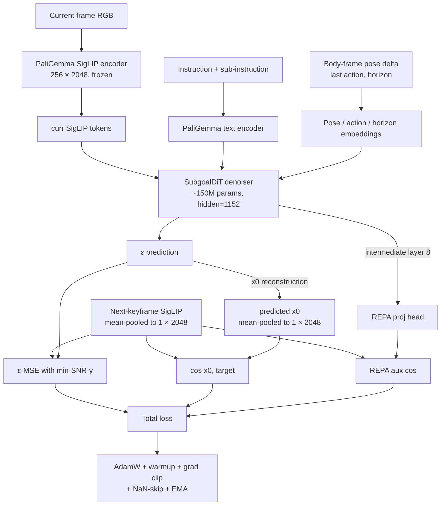

# How the SkyVLA OpenFly implementation works

Five-minute tour of the moving parts. Deeper docs at the bottom.

## 1. The benchmark

[OpenFly](https://arxiv.org/abs/2502.18041) is an outdoor aerial VLN
benchmark. The "drone" is a kinematic camera that teleports between
poses — no physics, no flight controller, no collision response. Each
step is one A\* macro action from an 8-class space:

| ID | Action | Effect |
|---|---|---|
| 0 | `stop` | terminate |
| 1 / 8 / 9 | `forward 3m / 6m / 9m` | translate along yaw |
| 2 / 3 | `turn left / right 30°` | rotate |
| 4 / 5 | `up / down 3m` | altitude change |

A trajectory in `train.json` is a recorded A\* path:

```json
{
  "image_path": "env_airsim_18/astar_data/low_short/2025-1-8_19-2-1_xxx",
  "gpt_instruction": "Proceed in a straight line past the building, then turn left.",
  "action":     [9, 9, 9, 3, 1, 0],
  "index_list": ["t0", "t1", "t2", "t3", "t4", "t5"],
  "pos":        [[x0,y0,z0], …],
  "yaw":        [yaw0, …]
}
```

Each step has one rendered RGB frame on disk and one pose. Frames are
keyframes, not video — one step is roughly one second of drone motion.

The split that drives the research is **per-environment unseen**:

- `env_game_gtav` — cross-renderer shift (no GTA in training)
- `env_ue_smallcity` — new UE layout, same engine
- `env_gs_sjtu02` — new 3D Gaussian-Splat reconstruction

## 2. The architecture

```
┌──────────────────────────────────────────────────────────────────────┐
│  RGB ─► PaliGemma 3B ─► SigLIP tokens (256 × 2048)                   │
│                  │                                                   │
│                  ▼                                                   │
│            ┌───────────────────┐                                     │
│            │ SubgoalDiT (150M) │  feature-space diffusion            │
│            │ predicts next-    │  conditioned on text + pose delta   │
│            │ keyframe tokens   │                                     │
│            └─────────┬─────────┘                                     │
│                      │                                               │
│   curr + predicted-subgoal + history ─► cross-attn ─► action head    │
│                                                          │           │
│                                                          ▼           │
│                                              discrete action (0..7)  │
└──────────────────────────────────────────────────────────────────────┘
```

Two models, trained largely independently:

- **Action policy** — [`PaliGemmaVLNPolicy`](https://github.com/CodCodingCode/SkyVLA/blob/main/openfly/models/paligemma_vln.py).
  PaliGemma 3B + LoRA on `q_proj/k_proj/v_proj/o_proj`, a small
  cross-attention pool, and an 8-class action head. ~3M trainable
  parameters; PaliGemma itself stays frozen.
- **World model** — [`SubgoalDiT`](https://github.com/CodCodingCode/SkyVLA/blob/main/openfly/models/subgoal_dit.py).
  ~150M-param DiT operating entirely in PaliGemma's 2048-d SigLIP token
  space — no pixel decoder, no VAE. Predicts the SigLIP tokens of the
  next-keyframe view. Trained from scratch with a NaN-guarded skip-step
  for LR stability. We also tried a frozen
  [PixArt-Σ-initialised variant](https://github.com/CodCodingCode/SkyVLA/blob/main/openfly/models/subgoal_dit_pixart.py)
  with a thin SigLIP adapter; it didn't transfer (the SigLIP-token vs
  VAE-latent feature distance is too large for a 14M-param adapter to
  bridge). The from-scratch DiT is the only world model in the live
  pipeline. See the whitepaper §10 for the negative-result writeup.

Why feature space? PaliGemma's cross-attention eats SigLIP tokens
already; predicting pixels just to re-encode them is wasted compute.
Token-space inference runs in ~30–60 ms versus 0.5–3 s for pixel
diffusion — the difference between thousands of PPO rollouts being
viable or not.

## 3. The dataset, and how subgoal pairs are sampled

World-model training emits per-step samples:

```python
(current_rgb, subgoal_rgb, instruction, sub_instruction, pose, subgoal_pose, ...)
```

Subgoal pairing follows π0.7 Appendix C:

| Mode | Probability | Future frame |
|---|---|---|
| **Semantic** (end-of-segment) | **0.25** | The frame where the current same-action run ends. Variable horizon, language-aligned. |
| **Uniform** | **0.75** | `t + k`, `k ~ Uniform(1, 4)` actions ahead. Dense, short-horizon supervision. |

Both modes draw frames already on disk in the recorded A\* trajectory.
The world model never generates its own training data. See
[`openfly/dataset.py`](https://github.com/CodCodingCode/SkyVLA/blob/main/openfly/dataset.py);
the mix is controlled by `--subgoal_pairing {mixed,semantic_only,uniform_only}`.

## 4. Why a world model

A monolithic VLA does "interpret language → plan → pick action" all in
one forward pass. It works in seen scenes by memorising shortcuts; the
shortcuts don't transfer.

A world model gives the policy a concrete visual target instead of a
sentence. Action selection collapses from "reason about the future" to
"pick the action that moves my view toward this image." Same idea as
SuSIE and π0.7; SkyVLA does it in SigLIP feature space and adds
pose-delta conditioning because OpenFly's drone teleports
deterministically given the action sequence.

For the motivation see the [whitepaper](whitepaper) and the
[research plan](research-plan).

## 4½. Breaking the modal collapse — what training the WM actually took

For two weeks the WM val cosine similarity sat at the noise floor
(`val_cos ≈ 0`) despite training loss dropping cleanly. We tracked it to
a degenerate ε-MSE minimum: the model was learning to predict
near-mean noise, which minimises MSE while contributing nothing to
direction. The investigation ruled out, in order, hardware (no ECC,
GPU was fine), data scarcity (a balanced 50 k step-pair set didn't fix
it), regularisation (CFG + REPA marginal), and sampling quality (DDIM
ablation flat at 0). The objective itself was the problem.

Three changes broke the collapse together:

| Change | Why | CLI |
|---|---|---|
| **Mean-pool the subgoal target to 1 × 2048** | Predicting all 256 SigLIP tokens dilutes the directional signal across a 524 288-dim flatten. PaliGemma's cross-attention pools tokens to a single scene summary anyway, so pooling at the WM target costs nothing downstream and concentrates supervision on the direction the policy uses. | `--subgoal_pool mean` |
| **Direct cos-loss on `x0`** | Reconstruct the predicted `x0` from ε every step (`x0 = (x_t − √(1−ᾱ_t) · ε) / √ᾱ_t`), take cosine sim with target, add `(1 − cos)` to loss. ε-MSE has the degenerate mean-prediction minimum; cos-on-`x0` does not. | `--cos_loss_weight 0.3` |
| **Keep [REPA](https://arxiv.org/abs/2410.06940)** | Saturated near +0.99 throughout, so its own gradient is tiny — but it works as a representation prior that keeps intermediate features aligned with the target while cos-loss pulls the output head. | `--repa_layer_idx 8 --repa_weight 0.1` |

Numbers across two epochs of the balanced training set:

| Epoch | train_loss | val_loss | **val_cos (seen)** | **val_cos (unseen)** |
|------:|-----------:|---------:|-------------------:|---------------------:|
| 0 | 0.838 | 1.007 | **+0.086** | **+0.085** |
| 1 | 0.811 | 1.019 | **+0.107** | **+0.108** |

First time clearing the noise floor. The unseen split tracking — and
at epoch 1 beating — the seen split is the generalisation signal we
were missing. A multi-epoch resume run is in flight; live curves on
[W&B](https://wandb.ai/nathanyan2008p-personal/skyvla-subgoal-dit).

### Loss-flow diagram



### Per-env data balancing — a subtle gotcha

The OpenFly download is incomplete: only ~14 % of `train.json` steps
have local frames, and coverage is wildly uneven across envs
(`env_ue_bigcity` 91 %, `env_gs_ecust` 0 %). A naïve `--per_env_max_episodes`
cap fires *before* the image-existence filter, so any cap large enough
to produce a usable training set is still ~95 % bigcity. The new
`--per_env_max_index_samples N` caps step-pairs *after* the image
filter — N=10000 produces a ~50 k step-pair set with bigcity at ~20 %.
This is what "balanced" means in the result table above. Details in
[CLAUDE.md](https://github.com/CodCodingCode/SkyVLA/blob/main/CLAUDE.md)
under "Image data caveat".

### Crash-resilient training

Xid 43 ("GPU stopped processing") fires on this A100 at roughly ~50 % /
hour of sustained training. The trainer ships with `--auto_resume` +
`--ckpt_every_steps 500` + a tmux crash-loop wrapper that restarts on
non-clean exit, so a mid-run segfault drops at most ~3 min and resumes
with optimizer / EMA / history intact. Diagnostics
(`faulthandler.dump_traceback_later(120)`) are routed to
`<run_dir>/diagnostics.log` so they don't pollute the main training
log. Pattern documented in
[CLAUDE.md](https://github.com/CodCodingCode/SkyVLA/blob/main/CLAUDE.md)
under "Long-running training runs".

## 5. Training tracks

| Track | Trains | Notes |
|---|---|---|
| **P1 — BC SFT** | PaliGemma LoRA + heads | Offline imitation on `train.json`. [Code](https://github.com/CodCodingCode/SkyVLA/blob/main/openfly/train_paligemma.py) |
| **P2 — SubgoalDiT pretrain** | DiT only (PaliGemma frozen) | Offline feature-space diffusion. [Code](https://github.com/CodCodingCode/SkyVLA/blob/main/openfly/train_subgoal_dit.py) |
| **P3 — GRPO (PaliGemma)** | LoRA + heads | On-policy RL with reward presets. [Code](https://github.com/CodCodingCode/SkyVLA/blob/main/openfly/train_grpo_paligemma.py) |
| **P3 — Curriculum GRPO** | same as above | Easy → medium → hard reward sparsity. [Code](https://github.com/CodCodingCode/SkyVLA/blob/main/openfly/train_curriculum_grpo.py) |
| **P3 — PPO (OpenFly-Agent 7B)** | LoRA + value head | OpenVLA 7B PPO. [Code](https://github.com/CodCodingCode/SkyVLA/blob/main/openfly/train_ppo_openfly_agent.py) |

No DAgger stage. PPO's on-policy rollouts subsume DAgger's
distribution-shift fix, and OpenFly's geometric oracle is too weak to
teach obstacle avoidance in a kinematic env.

Phases that touch the world model:

```
P1 BC ─► P2 World-model pretrain ─► P3 BC with subgoals ─► P4 CM distill (opt.)
                                              │
                                              ▼
                                P5 PPO/GRPO + curriculum + subgoals
                                              │
                                              ▼
                                      Per-env eval
```

The world model is frozen everywhere outside P2 and P4. RL never
trains it.

## 6. Reward presets and the curriculum

Curriculum lives in [`openfly/rewards.py`](https://github.com/CodCodingCode/SkyVLA/blob/main/openfly/rewards.py),
driven by [`train_curriculum_grpo.py`](https://github.com/CodCodingCode/SkyVLA/blob/main/openfly/train_curriculum_grpo.py).
Three presets, each loaded as the next stage's `--init_ckpt`:

| Preset | `progress_scale` | `ne_scale` | `success_scale` | `dense_progress` | Interpretation |
|---|---|---|---|---|---|
| `easy`   | 0.1 | 1/40 | 15.0 | True  | Thick step shaping + soft terminal terms |
| `medium` | 0.0 | 1/40 | 15.0 | False | Terminal NE penalty + soft success |
| `hard`   | 0.0 | 0.0  | 20.0 | False | Almost-binary success + SPL only |

Success radius (20 m) and SPL weighting stay constant across stages so
the reward stays comparable to OpenFly's eval metrics — see
[`BENCHMARK_FAIRNESS.md`](https://github.com/CodCodingCode/SkyVLA/blob/main/docs/BENCHMARK_FAIRNESS.md).

## 7. Evaluation

One harness, [`openfly/eval_benchmark.py`](https://github.com/CodCodingCode/SkyVLA/blob/main/openfly/eval_benchmark.py),
handles every policy (`heuristic`, `paligemma`, `grpo`,
`openfly_agent`, `ppo`). Each run writes
`logs/benchmarks/openfly_<split>_<policy>_<env>.json` with:

- **SR** — success rate within 20 m, requires `stop` action
- **OSR** — oracle success: any point within 20 m, ignores `stop`
- **NE** — mean navigation error in metres
- **SPL** — success weighted by path length
- per-env breakdown, episode-level metadata, `image_error` flags

Aggregation: [`openfly/scripts/aggregate_results.py`](https://github.com/CodCodingCode/SkyVLA/blob/main/openfly/scripts/aggregate_results.py)
rolls all `logs/benchmarks/*.json` into Markdown / CSV. Failure-mode
breakdown: [`openfly/scripts/analyse_failures.py`](https://github.com/CodCodingCode/SkyVLA/blob/main/openfly/scripts/analyse_failures.py).

## 8. Running the stack

```bash
# Setup (one-time)
bash openfly/setup.sh
bash openfly/download_train_images.sh           # ~100 GB of train frames

# P1 — BC baseline
bash openfly/run_train_paligemma.sh --epochs 10 --batch_size 8

# P2 — SubgoalDiT pretrain (from-scratch, the live world model)
bash openfly/run_train_subgoal_dit.sh \
  --epochs 5 --batch_size 8 \
  --depth 12 --hidden 1024 --num_heads 16 \
  --subgoal_pairing mixed --subgoal_semantic_prob 0.25

# Per-env unseen eval
for ENV in env_game_gtav env_ue_smallcity env_gs_sjtu02; do
  bash openfly/run_eval.sh --split unseen --policy paligemma \
    --paligemma_ckpt <ckpt> --env_filter "$ENV" --max_episodes 50
done
```

See [`docs/setup.md`](setup) and
[`docs/A100_SETUP.md`](https://github.com/CodCodingCode/SkyVLA/blob/main/docs/A100_SETUP.md)
for full host bring-up.

## 9. Deeper docs

| Doc | Contents |
|---|---|
| [Whitepaper](whitepaper) | Vision + motivation in one page |
| [Research plan](research-plan) | Long-form experimental design |
| [Results](results) | Per-env unseen table (filled in as runs complete) |
| [Setup](setup) | Quickstart |
| [Benchmark fairness](https://github.com/CodCodingCode/SkyVLA/blob/main/docs/BENCHMARK_FAIRNESS.md) | What's claimable |
| [Next steps](https://github.com/CodCodingCode/SkyVLA/blob/main/docs/NEXT_STEPS.md) | Engineering checklist |
| [GitHub](https://github.com/CodCodingCode/SkyVLA) | Code |
