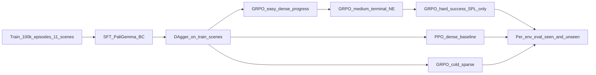

# SkyVLA

**Curriculum sparse RL for outdoor aerial vision-language navigation
on the [OpenFly](https://github.com/SHAILAB-IPEC/OpenFly-Platform)
benchmark.**

This site documents an ongoing study: *after* imitation-learning a
PaliGemma-based VLN policy on OpenFly's training scenes, **does a
reward-sparsity curriculum during online RL improve navigation on
genuinely new scenes — and which type of domain shift does RL actually
fix?**

[Research method](research) ·
[Results](results) ·
[Setup](setup) ·
[GitHub repository](https://github.com/CodCodingCode/SkyVLA)

## Research question

> After imitation on OpenFly `train`, does a reward-sparsity curriculum
> during online RL improve navigation on the three never-trained
> environments below — and which kind of domain shift does RL actually
> close?

We deliberately break the unseen set apart by **shift type** rather
than averaging it into a single number.

<div class="env-grid" markdown="1">
<div class="env-card" markdown="1">
### env_game_gtav
Cross-renderer shift. **Zero GTA episodes in training.** Hardest
visual OOD.
</div>
<div class="env-card" markdown="1">
### env_ue_smallcity
New Unreal Engine layout. Same engine as training (`ue_bigcity` is in
train) but different city geometry and semantics.
</div>
<div class="env-card" markdown="1">
### env_gs_sjtu02
New 3D Gaussian Splatting campus. Same pipeline as training
(`gs_sjtu01`) but a different real-to-sim reconstruction.
</div>
</div>

## Method at a glance



The full method, reward presets, and experiment matrix are on the
[research page](research).

## What is fair to claim

We follow the project's
[benchmark fairness guidelines](https://github.com/CodCodingCode/SkyVLA/blob/main/docs/BENCHMARK_FAIRNESS.md).
Headline rules:

- Report **per-env** unseen results, not a single averaged number.
- Use the same eval harness and `--max_steps` budget for every checkpoint.
- Do not call fine-tuned numbers *zero-shot*.
- The oracle heuristic is a geometric upper bound, not a model result.

## Citation

```bibtex
@software{codcodingcode_skyvla,
  author = {CodCodingCode},
  title  = {SkyVLA: outdoor aerial vision-language navigation with OpenFly},
  year   = {2026},
  url    = {https://github.com/CodCodingCode/SkyVLA}
}
```
