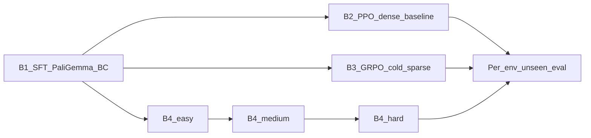

# Research method

The long-form, code-linked version of this page lives in
[`docs/RESEARCH.md`](https://github.com/CodCodingCode/SkyVLA/blob/main/docs/RESEARCH.md)
in the repository. This page is the shorter, public-facing summary.

## Splits we use

OpenFly's splits are **not** random train/val/test slices; they are
cross-scene splits, which is what makes them informative for
generalisation.

| Split | Episodes | Role |
|-------|---------:|------|
| `train` | 100,226 | 11 scenes — SFT, RL rollouts |
| `seen` | 1,800 | Dev / monitoring on the same 11 scenes |
| `unseen` | 1,200 | Primary claim — 3 never-trained scenes |

The three unseen environments are heterogeneous:

| Unseen env | Shift type | Why it matters |
|------------|------------|----------------|
| `env_game_gtav` | New renderer + game world | Hardest visual OOD |
| `env_ue_smallcity` | New UE layout | Layout / semantics, same engine |
| `env_gs_sjtu02` | New 3DGS campus | Real-to-sim recon style OOD |

We also track an altitude shift: unseen episodes have median altitude
~73 m vs ~23 m in train.

## Reward presets

Implemented in
[`openfly/rewards.py`](https://github.com/CodCodingCode/SkyVLA/blob/main/openfly/rewards.py)
and selected with the `--reward_preset` flag on the GRPO and PPO
trainers (plumbed through `AirSimVLNEnvConfig.reward_preset`).

| Preset | `progress_scale` | `ne_scale` | `success_scale` | Dense progress | Notes |
|--------|-----------------:|-----------:|----------------:|---------------:|-------|
| `easy`   | 0.1   | 1/40 | 15.0 | on  | Thick step shaping + soft terminal terms |
| `medium` | 0.0   | 1/40 | 15.0 | off | Terminal NE penalty + soft success |
| `hard`   | 0.0   | 0.0  | 20.0 | off | Almost-binary success + SPL only |

Success radius (20 m) and SPL weight are constant across stages so the
reward stays comparable to the OpenFly leaderboard metric.

## Pipeline

RL stages bootstrap directly from the SFT checkpoint — no DAgger stage.

## Experiment matrix

| Stage | Source | Reward | Init |
|-------|--------|--------|------|
| **B0** Heuristic | `run_eval.sh --policy heuristic` | n/a | n/a |
| **B1** SFT | `run_train_paligemma.sh` | n/a | random head |
| **B2** RL dense | `run_train_ppo_agent.sh --reward_preset easy` | easy | B1 |
| **B3** RL cold sparse | `run_train_grpo.sh --reward_preset hard` | hard | B1 |
| **B4** RL curriculum | `run_train_curriculum.sh` | easy &rarr; medium &rarr; hard | B1 |

The curriculum driver
([`openfly/train_curriculum_grpo.py`](https://github.com/CodCodingCode/SkyVLA/blob/main/openfly/train_curriculum_grpo.py))
runs each stage as a subprocess of the underlying GRPO trainer and
threads the previous stage's `last.pt` into the next stage's
`--init_ckpt`.

## How we read the results

Each checkpoint is evaluated identically: same harness, same
`--max_steps`, and the per-env unseen breakdown is reported separately
for `env_game_gtav`, `env_ue_smallcity`, and `env_gs_sjtu02`.

We consider the study informative when **either**:

1. B4 beats B1 on at least one unseen env with the same eval budget
   *and* B4 also beats B3 (so the credit goes to the curriculum, not
   just to RL); or
2. B4 fails on GTA but improves smallcity and sjtu02, in which case the
   finding is: **RL closes layout/recon gaps but not renderer gaps
   without a domain bridge.**

A null result (everything within noise) is reported honestly as a
negative finding.

## Pointers to code

| Concern | Code |
|---------|------|
| Reward presets | [`openfly/rewards.py`](https://github.com/CodCodingCode/SkyVLA/blob/main/openfly/rewards.py) |
| Env wiring | [`openfly/envs/airsim_vln_env.py`](https://github.com/CodCodingCode/SkyVLA/blob/main/openfly/envs/airsim_vln_env.py) |
| GRPO (preset + traj filter) | [`openfly/train_grpo_paligemma.py`](https://github.com/CodCodingCode/SkyVLA/blob/main/openfly/train_grpo_paligemma.py) |
| PPO (preset) | [`openfly/train_ppo_openfly_agent.py`](https://github.com/CodCodingCode/SkyVLA/blob/main/openfly/train_ppo_openfly_agent.py) |
| Curriculum driver | [`openfly/train_curriculum_grpo.py`](https://github.com/CodCodingCode/SkyVLA/blob/main/openfly/train_curriculum_grpo.py) |
| Per-env eval | [`openfly/eval_benchmark.py`](https://github.com/CodCodingCode/SkyVLA/blob/main/openfly/eval_benchmark.py) |
| Aggregation | [`openfly/scripts/aggregate_results.py`](https://github.com/CodCodingCode/SkyVLA/blob/main/openfly/scripts/aggregate_results.py) |
| Policy backbone | [`openfly/models/paligemma_vln.py`](https://github.com/CodCodingCode/SkyVLA/blob/main/openfly/models/paligemma_vln.py) |
